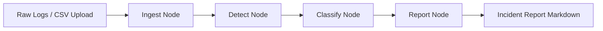

# Cyber Detect AI Agent

A production-oriented, multi-agent cybersecurity workflow that turns raw logs into structured incident intelligence.

Built on LangGraph + LangChain, this project automates the full incident analysis path: ingestion, threat detection, risk classification, and report generation.

## Highlights

- End-to-end multi-agent pipeline with shared state
- ReAct-style detection using callable security tools
- Threat-intel-assisted risk scoring (0-100)
- Auto-generated Markdown incident reports in `reports/`
- Dual interfaces: CLI simulation and Gradio UI

## Workflow



### Node Responsibilities

1. `ingest.py`: validates input and prepares CSV path when applicable.
2. `detect.py`: runs LLM reasoning with tools (`query_security_logs`, `check_ip_reputation`).
3. `classify.py`: enriches findings using threat intel and computes risk score.
4. `report.py`: creates and persists a final incident report.

## Tech Stack

- Python 3.13+
- LangGraph
- LangChain / LangChain Groq
- Gradio
- Pandas

## Project Layout

```text
.
├── main.py
├── run_gradio_app.py
├── data/
├── reports/
├── src/incident_agents/
│   ├── graph.py
│   ├── state.py
│   ├── config.py
│   ├── nodes/
│   └── tools/
└── tests/
```

## Quick Start (uv Recommended)

```bash
uv sync
cp .env.example .env
```

Then set your key in `.env`:

```env
GROQ_API_KEY=your_groq_api_key_here
```

## Run the Project

CLI simulation:

```bash
uv run python main.py
```

Gradio app:

```bash
uv run python run_gradio_app.py
```

## Validation

```bash
uv run python -m compileall -q .
uv run pytest -q
```

## Common Issues

- `Missing GROQ_API_KEY`: create `.env` and set a valid key.
- Missing packages: run `uv sync` and use `uv run ...`.

## License

Apache License 2.0. See `LICENSE`.
